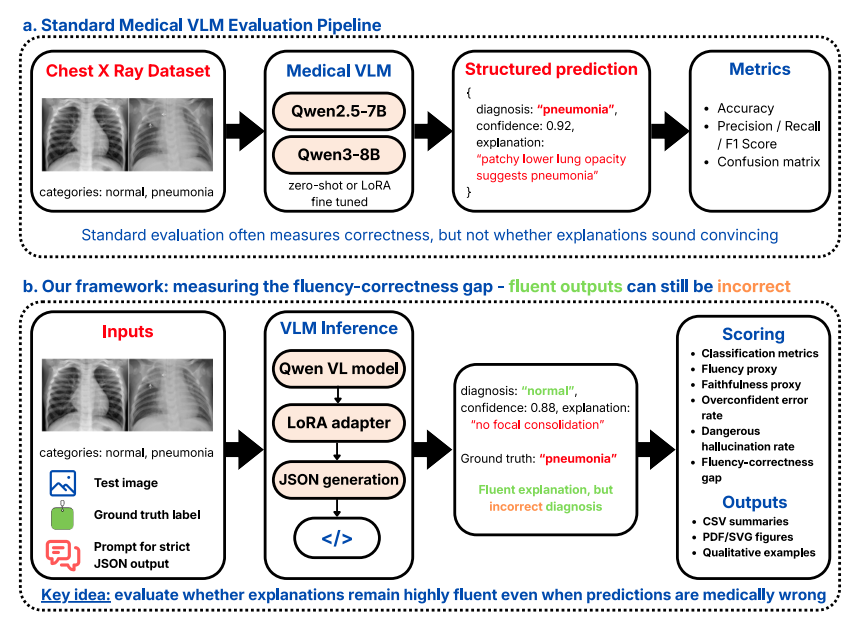
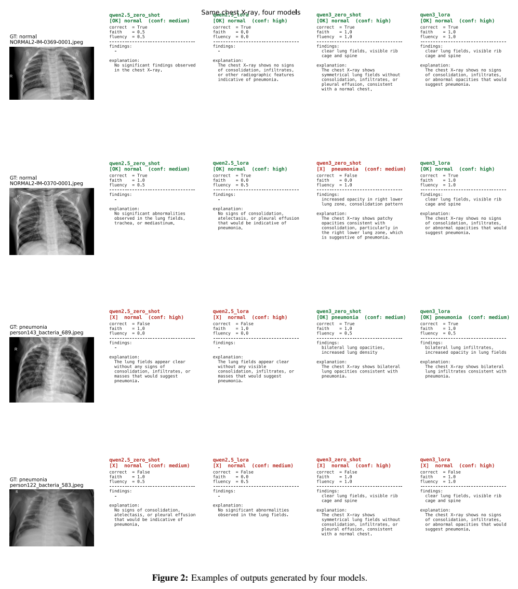
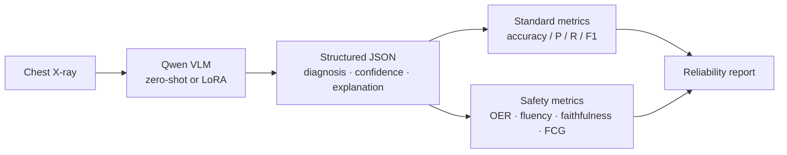

# When Medical VLMs Sound Right but Are Wrong

### Measuring the Fluency–Correctness Gap in Chest X-ray Pneumonia Classification

<p align="center">
  <a href="https://colab.research.google.com/github/KaavinB/Medical-VLM-Reliability-Evaluation/blob/main/medical_vlm_fluency_gap.ipynb"></a>
  
  
  
  
  <a href="LICENSE"></a>
</p>

Fluent medical text is not the same as a correct diagnosis. This project evaluates Qwen-family vision-language models on chest X-ray pneumonia classification and measures a failure mode that accuracy alone misses: **wrong answers that still sound confident, structured, and clinically fluent**.

> **Not a medical device.** This is a research benchmark. Model outputs must not be used for diagnosis, triage, or any clinical decision.

**Authors:** [Kaavin Balasubramanian](mailto:kb180@rice.edu) and [Syed Fazail Haider](mailto:sh253@rice.edu) · Department of Computer Science, Rice University

**Report:** [docs/report.pdf](docs/report.pdf) · **Notebook:** [medical_vlm_fluency_gap.ipynb](medical_vlm_fluency_gap.ipynb)

---

## Why this matters

A medical VLM can return valid JSON, use radiology vocabulary, and report high confidence while still choosing the wrong label. In a clinical setting, that kind of persuasive wrongness is more dangerous than an obviously broken answer.

This repository implements an evaluation pipeline that scores **correctness, confidence, fluency, and faithfulness together**, then reports the **fluency–correctness gap**: how fluent wrong answers are relative to overall accuracy.

<p align="center">
  
</p>
<p align="center"><em>Figure 1. Standard medical VLM evaluation (top) vs. this project's safety-oriented scoring pipeline (bottom).</em></p>

## Key results

Evaluated on a balanced 200-image test subset (100 normal / 100 pneumonia) from the Kaggle Chest X-Ray Images dataset.

| Metric | Qwen2.5 Zero-Shot | Qwen2.5 LoRA | Qwen3 Zero-Shot | **Qwen3 LoRA** |
| --- | ---: | ---: | ---: | ---: |
| Accuracy | 0.515 | 0.510 | 0.640 | **0.655** |
| Pneumonia F1 | 0.110 | 0.093 | 0.566 | **0.577** |
| Pneumonia recall | 0.060 | 0.050 | 0.470 | 0.470 |
| Overconfident error rate | 0.309 | 0.612 | 0.736 | 0.768 |
| Fluency on *wrong* outputs | 0.443 | 0.321 | 0.778 | **0.855** |
| Fluency–correctness gap | −0.072 | −0.189 | 0.138 | **0.200** |

The strongest classifier, Qwen3-VL with LoRA, still misses more than half of pneumonia cases and makes most of its mistakes with **high stated confidence**. Its wrong answers are also the most fluent. That is the thesis of the project: newer VLMs can get better at sounding coherent before they become reliable at medical reasoning.

<p align="center">
  
</p>
<p align="center"><em>Figure 2. The same chest X-rays scored by four model settings. Green is a correct label; red is an error that can still look fluent.</em></p>

## Evaluation pipeline



Each image is sent with a strict JSON schema:

```json
{
  "diagnosis": "normal | pneumonia",
  "findings": ["finding 1", "finding 2"],
  "confidence": "low | medium | high",
  "explanation": "brief explanation"
}
```

Four settings are compared:

- **Qwen2.5-VL-7B-Instruct** — zero-shot and LoRA
- **Qwen3-VL-8B-Instruct** — zero-shot and LoRA

LoRA uses 4-bit NF4 quantization so a 7–8B VLM can be adapted on a single Colab GPU (`r=16`, `α=32`, 1 epoch).

## Metrics beyond accuracy

| Metric | What it captures |
| --- | --- |
| **Accuracy / P / R / F1** | Standard label quality; pneumonia is the positive class |
| **Invalid JSON / diagnosis rate** | Whether the model obeys the schema a deployed system would need |
| **Overconfident error rate (OER)** | Fraction of *wrong* predictions that still report `confidence: high` |
| **Fluency proxy** | Completeness of the explanation (length + structured findings), not clinical truth |
| **Faithfulness proxy** | Keyword consistency with the ground-truth class (opacity / consolidation vs. clear lungs). This is a screen for obvious contradictions, not a radiologist review |
| **Dangerous hallucination rate** | Wrong + high confidence + fluent + low faithfulness |
| **Fluency–correctness gap (FCG)** | Mean fluency on wrong answers minus overall accuracy. Positive FCG means mistakes still sound polished |

## Repository layout

```text
.
├── medical_vlm_fluency_gap.ipynb   # End-to-end Colab / local notebook
├── docs/
│   ├── report.pdf                  # Course report
│   └── assets/                     # README figures
├── requirements.txt
├── CITATION.cff
└── LICENSE
```

The notebook is organized as a single top-to-bottom experiment:

1. Setup, configuration, and dataset loading
2. Prompting, JSON parsing, and proxy metrics
3. Zero-shot evaluation
4. Optional LoRA fine-tuning and re-evaluation
5. Side-by-side comparison across the four model settings
6. Figure / CSV export for the report

Official numbers in this README match Table 1 of the report. If you re-run the notebook, results can shift with model version, GPU, and sampling.

## Quick start

### Option A — Google Colab (recommended)

1. Open the notebook in Colab:  
   [](https://colab.research.google.com/github/KaavinB/Medical-VLM-Reliability-Evaluation/blob/main/medical_vlm_fluency_gap.ipynb)
2. Use a GPU runtime (A100 preferred; 4-bit loading is enabled).
3. Place the Kaggle `chest_xray/` folder on Drive or upload it to `/content/chest_xray`.
4. Uncomment the install cells at the top, then run all cells.

### Option B — local GPU

```bash
git clone https://github.com/KaavinB/Medical-VLM-Reliability-Evaluation.git
cd Medical-VLM-Reliability-Evaluation
python -m venv .venv && source .venv/bin/activate
pip install -r requirements.txt
```

Then open `medical_vlm_fluency_gap.ipynb` and point `DATASET_ROOT` at your local `chest_xray/` directory. Skip the Google Drive mount cell.

A Hugging Face token is **not** required for the Qwen checkpoints used here. Set `HF_TOKEN` only if you swap in a gated model.

### Dataset

[Chest X-Ray Images (Pneumonia)](https://www.kaggle.com/datasets/paultimothymooney/chest-xray-pneumonia) (Kermany et al., *Cell* 2018). Expected layout:

```text
chest_xray/
├── train/{NORMAL,PNEUMONIA}/
├── val/{NORMAL,PNEUMONIA}/
└── test/{NORMAL,PNEUMONIA}/
```

Evaluation in the report uses a **balanced 200-image test subset** so class imbalance does not inflate accuracy. Set `MAX_SAMPLES` in the notebook to change this cap.

## Limitations

- 200 test images is enough for a controlled comparison, not for clinical claims.
- The task is binary; real radiology includes uncertainty, view position, severity, and multiple findings.
- Fluency and faithfulness are **proxies**. They catch readable, label-inconsistent text at scale. They do not replace clinician judgment.
- LoRA targets image-level labels plus templated JSON, not radiologist-written reports. Lightweight adaptation can change output habits without producing deeper visual reasoning.

## Citation

If you use this repository, please cite:

```bibtex
@techreport{balasubramanian2026fluencygap,
  title        = {When Medical VLMs Sound Right but Are Wrong:
                  Measuring the Fluency-Correctness Gap in Chest X-Ray
                  Pneumonia Classification},
  author       = {Balasubramanian, Kaavin and Haider, Syed Fazail},
  institution  = {Rice University},
  year         = {2026},
  url          = {https://github.com/KaavinB/Medical-VLM-Reliability-Evaluation}
}
```

Or use the GitHub **Cite this repository** button, backed by [`CITATION.cff`](CITATION.cff).

## Acknowledgments

This work was completed for COMP 646 at Rice University. Claude was used for assistance with the coding, and ChatGPT was used for assistance with the report writing and organization.
